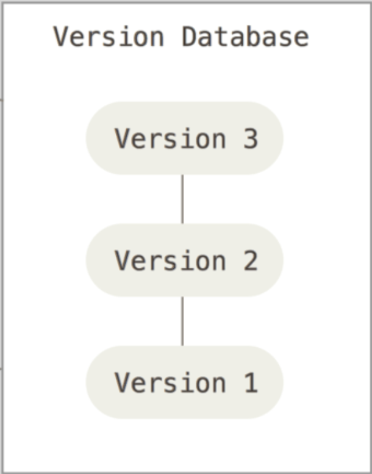
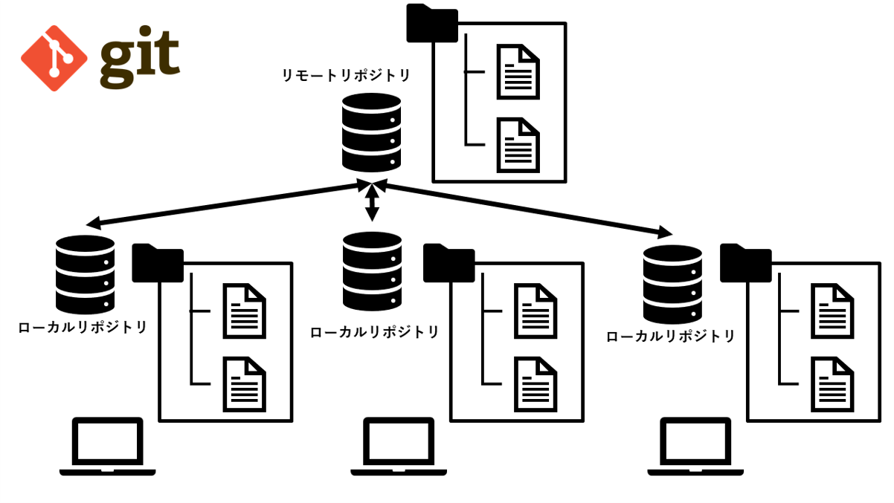

# Git講習会

### @hijiki51

---
## 座学編

- Gitとは
- Gitの仕組み

## 実習編
未定

---

# Gitとは

---
## バージョン管理

- セーブポイントのようなもの
- 変更の記録を管理 
  - 時間とともに記録
  - 必要な時点に戻れる

- 例)問題が起きた時
  - 問題の発生前まで戻る
  - 変更を見て原因を調査する

---

## Git

- https://git-scm.com/
- バージョン管理システムの一つ
  - 他にもSubversion, Mercurialなどがある
- ファイル変更の履歴を保存・管理
  - **いつ、誰が、何を変更したか**
- GitHub / GitLab は**履歴共有**のためのサービス

---

## 変更履歴をどう共有するか？
管理方法は大きく以下の三つに分類できる

- ローカル管理
- 集中管理
- 分散管理

---

## ローカルバージョン管理

**メリット**
- ローカルにバージョン情報を保存する

**デメリット**
- 他人と共有がしにくい

---

## 集中バージョン管理

**メリット**
- 共有サーバーに保存する
- 複数人で共有できる

**デメリット**
- 同時に作業すると巻き戻ることも
- サーバーが落ちたり壊れると被害が大きい

---

## 分散バージョン管理

- ローカルにもバージョン情報を保存
  - 他人を待たずに作業可能
  - サーバーが落ちてもローカルから復元可能

---

# Gitの仕組み

---

## Repository 

**Gitがバージョン管理を行う単位**
- ディレクトリ + Version Database (.git/)で構成
- リポジトリ内のファイルの変更履歴を保存

### Remote Repository
- 共有サーバー上にある Repository

### Local Repository
- 自分の手元にある Repository

---

## 

---

## Commit
- 「バージョン」の Git 内での呼び名
  - セーブポイントを作るイメージ
  - 一意なIDを持つ
- Gitは Commit を基準として状態を移動する
  - Commit したときの状態が帆zんされる
  - Commit されていない時点には移れない
    - Commit の間の編集中の状態とか
- HEAD:自分が今いる Commit (基本的には最新コミット)

---

## Push / Pull
- Remote と Local のバージョン履歴を同期する
- **Push** : Local → Remote
    - Push すると Remote も Local と同じ状態になる
    - **他の人からも変更がわかるようになる**
- **Pull** : Remote → Local
    - Remote の変更を Local に持ってくる
    - **他の人の変更が自分の手元に反映される**

---

この講習会の資料はすべて Git で管理されています
- https://github.com/hijiki51/git-lecture