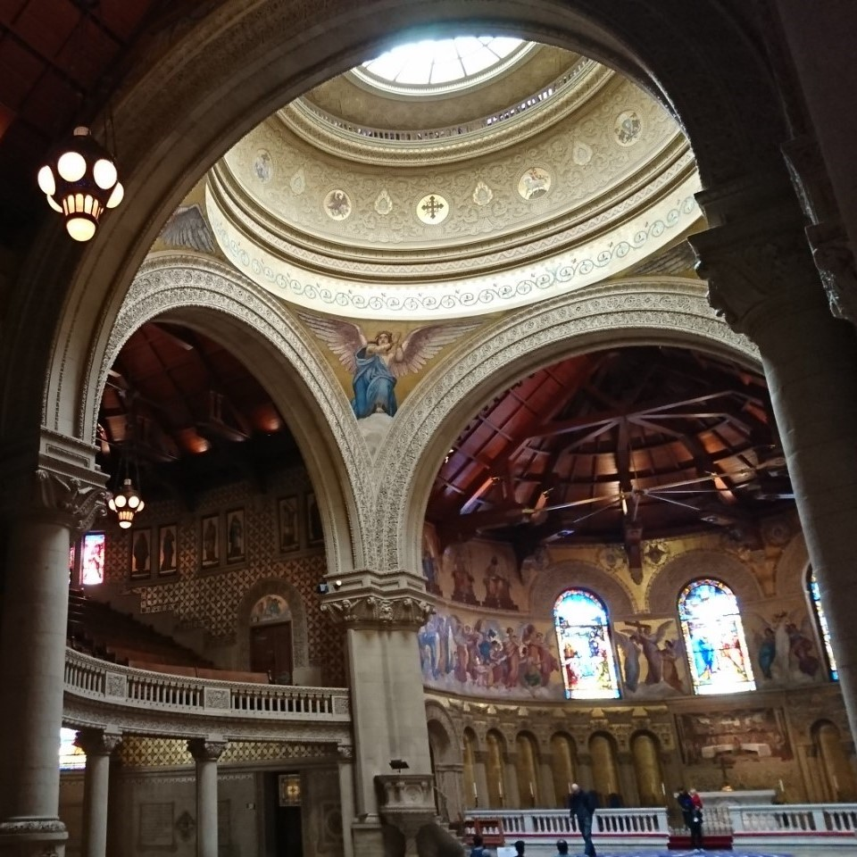
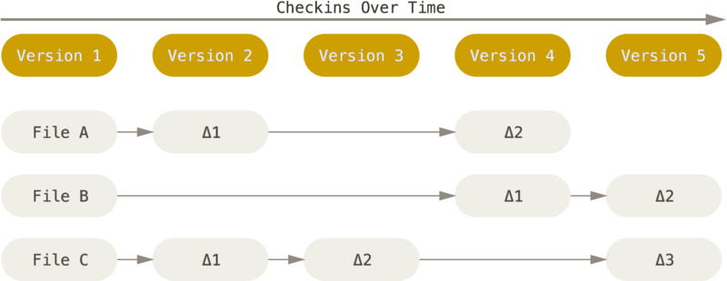
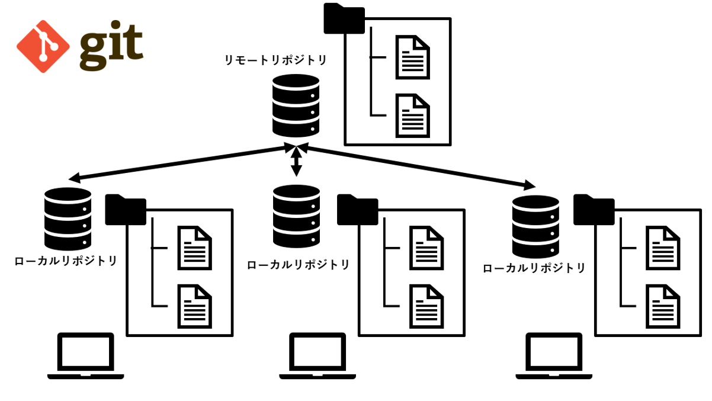
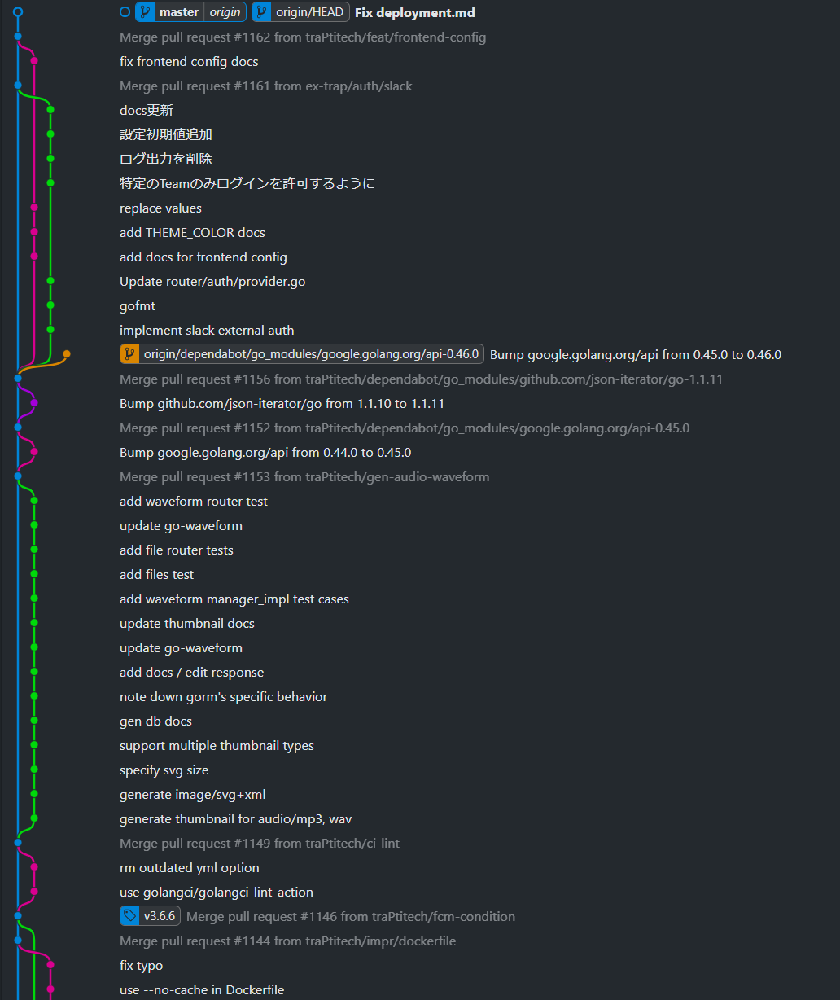
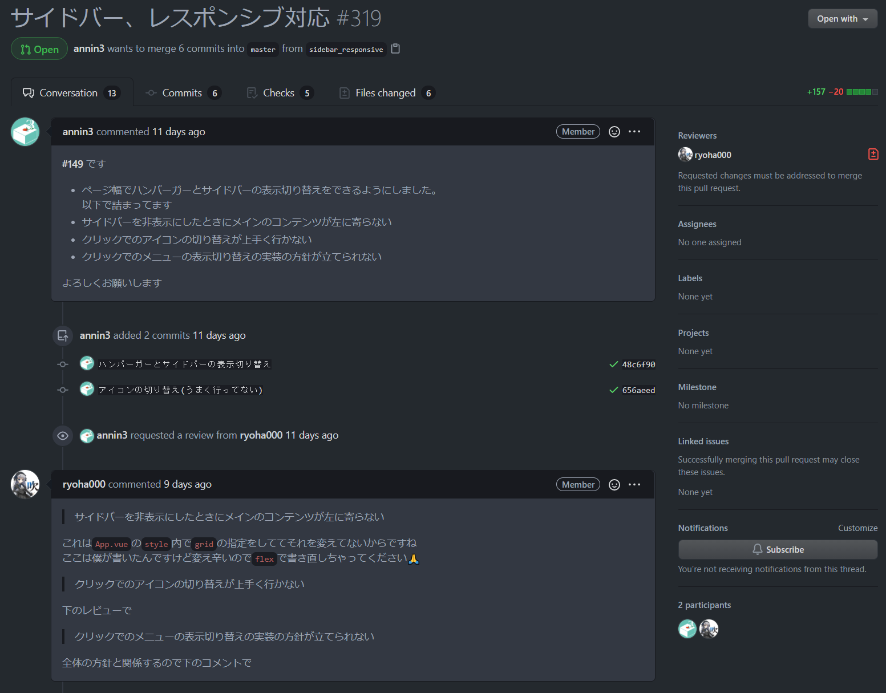

<!--
headingDivider: 2
-->

<!--
class: slides
-->

# git講習会

<!--
_class: title
-->

### @hijiki51

#  @hijiki51,@tesso

<!--
_class: user
-->

- 物理学系二年
- Game
- SysAd

#  @tesso

<!--
_class: user
-->

- 数理計算科学系
- Game
- SysAd
- CTF
## 座学編

- Gitとは
- Gitの目的
- Gitの仕組み

# Gitとは

<!--
_class: title
-->
## バージョン管理

- ファイルの変更の記録を管理 
  - 時間とともに記録
  - 必要な時点に戻れる

- 例)問題が起きた時
  - 問題の発生前まで戻る
  - 変更を見て原因を調査する
<!-- ## 差分とスナップショット
- 差分
  - 変更の情報をリストとして持つ
  - 各バージョンごとにすべてのデータを持つわけではない

## 差分とスナップショット
- スナップショット
  - 各バージョンごとにすべてのデータを持つ
  - 変更がない時は以前の同一のファイルへのリンクを格納する
 -->
## データをどこに置くか？

- ローカル
- 集中
- 分散

## ローカル・バージョン管理

- ローカルにバージョン情報を保存する
- 他人と共有がしにくい
## 集中バージョン管理

- サーバーにデータを保存する
- 複数人で共有できる
- サーバーが落ちたり壊れると被害が大きい

## 分散バージョン管理

- 手元にもミラーリングされる
- すべてのレポジトリがバックアップとなる

## Gitの目的
- 分散バージョン管理システム
- **いつ、誰が、どこを、どのように**変更したか

# Gitの仕組み
<!--
_class: title
-->
## Repository
- ファイルの構造を保存する
- ファイルの状態を保存する
  - 変更履歴の記録がある
## 

## Commit
- その前のコミットからの変更を保存する
  - セーブポイントを作るイメージ
- gitはコミットを基準として状態を移動する
  - コミットを起点に移動する
  - コミットでない時点には移れない
    - コミットの間の編集中の状態とか
- HEAD:自分が今いるコミット(デフォルトはブランチの最新コミット)
## Branch
- 開発の本流から分岐し、開発の本流を妨げることなく作業を進めるための仕組み
- main(master)ブランチ：本流

## 

## Merge(併合)
- 他のブランチの変更を取り込む
- 取り込むときにはマージコミットというコミットが作成される
- 取り込むときに、同じファイルに異なる変更が存在すると、Conflict(競合)する

- AをBにマージする$\neq$BをAにマージする

## Pull Request
- 変更の入ったブランチを他のブランチにマージしてくれとお願いする
- 大体はmain(master)
- Remote Repositoryで行われる
## 

## 実演(PR&Merge)
<!--
_class: title
-->
## 参考文献

- Git公式
  - https://git-scm.com/book/ja/v2
