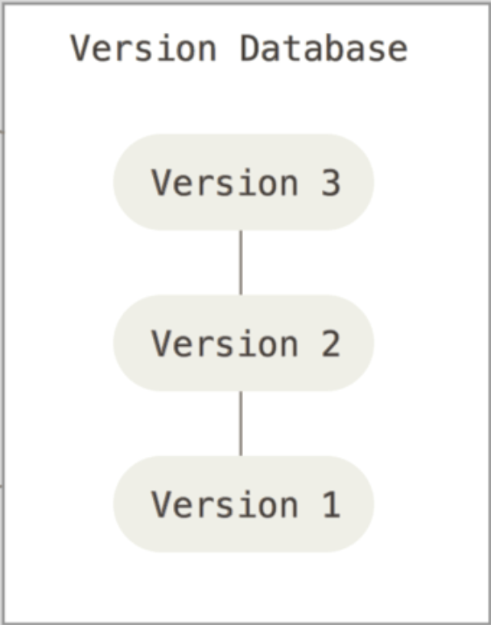
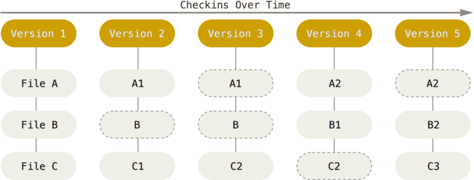

<!--
headingDivider: 2
-->

<!--
class: slides
-->

# git講習会

<!--
_class: title
-->

### @hijiki51

#  @hijiki51

<!--
_class: user
-->

- 物理学系二年
- Game
- SysAd
## 座学編

- Gitとは
- Gitの目的
- Gitの仕組み

# Gitとは

<!--
_class: title
-->
## バージョン管理

- ファイルの変更の記録を管理 
  - 時間とともに記録
  - 問題がいつ起きたかの調査
  - 必要な地点に戻ることが出来る 

## 差分とスナップショット
- 差分
  - 変更の情報をリストとして持つ
  - 各バージョンごとにすべてのデータを持つわけではない

## 差分とスナップショット
- スナップショット
  - 各バージョンごとにすべてのデータを持つ
  - 変更がない時は以前の同一のファイルへのリンクを格納する

## データをどこに置くか？

- ローカル
- 集中
- 分散

## ローカル・バージョン管理

- ローカルにバージョン情報を保存する
- でも、他人と共有がしにくい…
## 集中バージョン管理

- サーバーにデータを保存する
- 複数人で共有できる
- サーバーが落ちたり壊れると被害が大きい

## 分散バージョン管理

- 手元にもミラーリングされる
- すべてのレポジトリがバックアップとなる

## Gitの目的
- 分散バージョン管理システム
- **いつ、誰が、どこを、どのように**変更したか

# Gitの仕組み
<!--
_class: title
-->
## Repository
- ファイルの構造を保存する
- ファイルの状態を保存する
  - 変更履歴の記録がある
## 

## Commit
- その前のコミットからの変更をコミットオブジェクトとして保存する
- コミットオブジェクト $\fallingdotseq$ スナップショット
  - 詳しくは[ここ](https://git-scm.com/book/ja/v2/Git%E3%81%AE%E5%86%85%E5%81%B4-Git%E3%82%AA%E3%83%96%E3%82%B8%E3%82%A7%E3%82%AF%E3%83%88)
- gitはコミットを基準として時系列が展開する
- HEAD:自分が今いるコミット(デフォルトはそのブランチの最新コミット)
## Branch
- 開発の本流から分岐し、開発の本流を妨げることなく作業を進めるための仕組み
- main(master)ブランチ：本流
## Marge

## Pull Request

## まとめ

## 参考文献